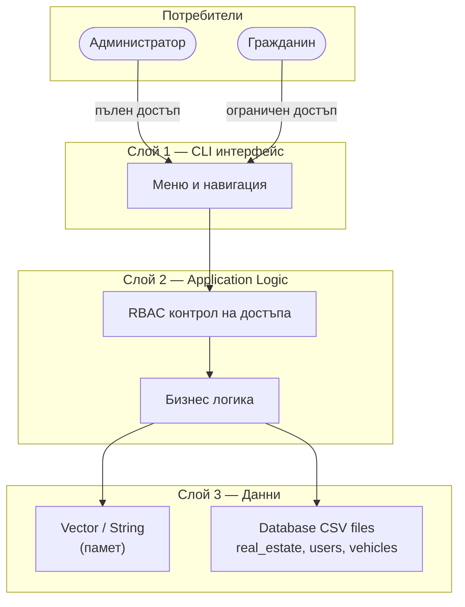

## Структурна диаграма
 

```mermaid
graph TD
  subgraph Потребители
    A([Администратор])
    C([Гражданин])
  end
 
  subgraph CLI["Слой 1 — CLI интерфейс"]
    M[Меню и навигация]
  end
 
  subgraph App["Слой 2 — Application Logic"]
    RBAC[RBAC контрол на достъпа]
    Logic[Бизнес логика]
  end
 
  subgraph Data["Слой 3 — Данни"]
    DS["Vector / String<br/>(памет)"]
    DB[Database CSV files<br/> real_estate, users, vehicles]
  end
 
 
  A -->|пълен достъп| M
  C -->|ограничен достъп| M
  M --> RBAC
  RBAC --> Logic
  Logic --> DS
  Logic --> DB
```
 
---

