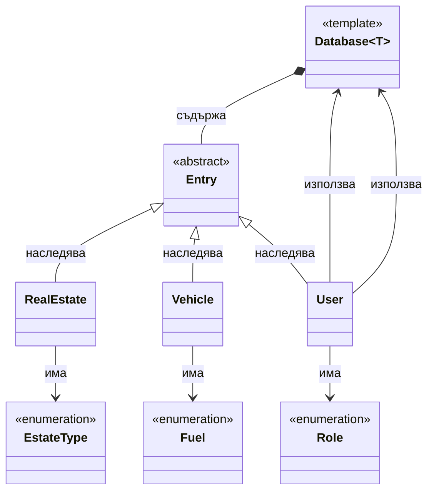

## UML Class Diagram

```mermaid
classDiagram

  class Database~T~ {
    <<template>>
  }

  class Entry {
    <<abstract>>
  }

  class RealEstate {
  }

  class EstateType {
    <<enumeration>>
  }

  class Vehicle {
  }

  class Fuel {
    <<enumeration>>
  }

  class User {
  }

  class Role {
    <<enumeration>>
  }

  Entry <|-- RealEstate : наследява
  Entry <|-- Vehicle : наследява
  Entry <|-- User : наследява

  Database~T~ *-- Entry : съдържа

  User --> Role : има
  RealEstate --> EstateType : има
  Vehicle --> Fuel : има

  User --> Database~Vehicle~ : използва
  User --> Database~RealEstate~ : използва
```
