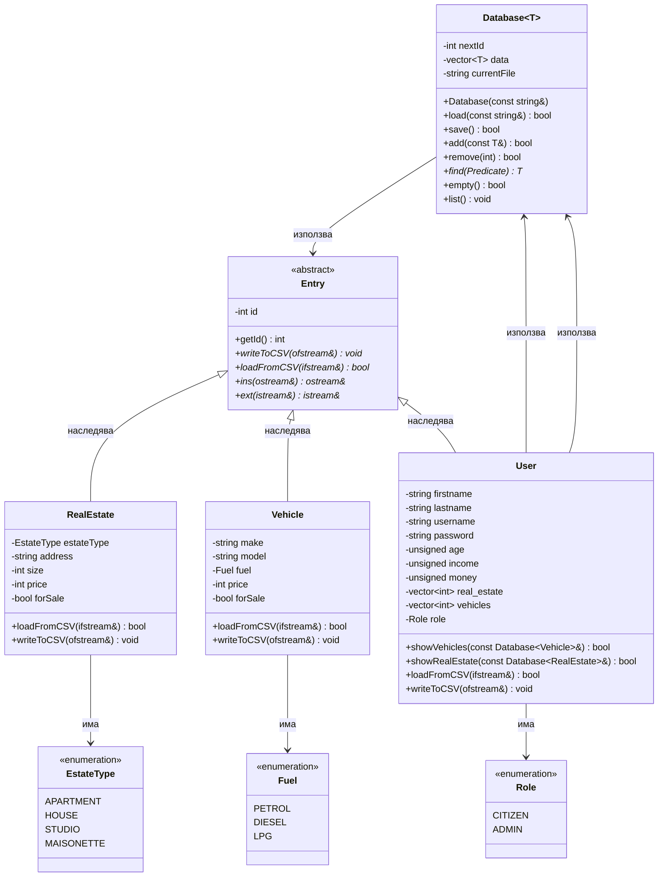

## UML Class Diagram

```mermaid
classDiagram

  class Database~T~ {
    -int nextId
    -vector~T~ data
    -string currentFile
    +Database(const string&)
    +load(const string&) bool
    +save() bool
    +add(const T&) bool
    +remove(int) bool
    +find(Predicate) T*
    +empty() bool
    +list() void
  }

  class Entry {
    <<abstract>>
    -int id
    +getId() int
    +writeToCSV(ofstream&) void*
    +loadFromCSV(ifstream&) bool*
    +ins(ostream&) ostream&*
    +ext(istream&) istream&*
  }

  class RealEstate {
    -EstateType estateType
    -string address
    -int size
    -int price
    -bool forSale
    +loadFromCSV(ifstream&) bool
    +writeToCSV(ofstream&) void
  }

  class EstateType {
    <<enumeration>>
    APARTMENT
    HOUSE
    STUDIO
    MAISONETTE
  }

  class Vehicle {
    -string make
    -string model
    -Fuel fuel
    -int price
    -bool forSale
    +loadFromCSV(ifstream&) bool
    +writeToCSV(ofstream&) void
  }

  class Fuel {
    <<enumeration>>
    PETROL
    DIESEL
    LPG
  }

  class User {
    -string firstname
    -string lastname
    -string username
    -string password
    -unsigned age
    -unsigned income
    -unsigned money
    -vector~int~ real_estate
    -vector~int~ vehicles
    -Role role
    +showVehicles(const Database~Vehicle~&) bool
    +showRealEstate(const Database~RealEstate~&) bool
    +loadFromCSV(ifstream&) bool
    +writeToCSV(ofstream&) void
  }

  class Role {
    <<enumeration>>
    CITIZEN
    ADMIN
  }

  Entry <|-- RealEstate : наследява
  Entry <|-- Vehicle : наследява
  Entry <|-- User : наследява

  Database~T~ --> Entry : използва

  User --> Role : има
  RealEstate --> EstateType : има
  Vehicle --> Fuel : има

  User --> Database~Vehicle~ : използва
  User --> Database~RealEstate~ : използва
```
